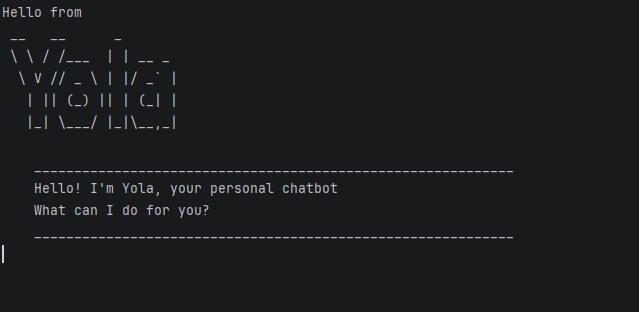

# Yola User Guide


### Screenshot of Yola chatbot


Yola is a command-line chatbot that helps you manage tasks such as todos, deadlines, and events.

## Quick start
1. Run the program.
2. Type your commands into the chat.
3. Yola will respond and update your task list automatically.

## Yola Commands
## Add Todo task
Adds an event with a description, as well as an event start and event end date.

Format: `todo DESCRIPTION`

Example: `todo hang up laundry`

Expected outcome:
```
    ____________________________________________________________
    Got it. I've added this task:
    [T][ ] hang up laundry
    Now you have 9 tasks in the list.
    ____________________________________________________________
```

## Add Deadline task

Adds a deadline task with a description and deadline for the task, to the task list.

Format: `deadline DESCRIPTION /by DEADLINE`

Example: `deadline complete CS2213 assignment /by Friday`

Expected outcome:
```
    ____________________________________________________________
    Got it. I've added this task:
    [D][ ] complete CS2213 assignment (by: Friday)
    Now you have 7 tasks in the list.
    ____________________________________________________________
```
## Add Event task
Adds an event with a description, as well as an event start and event end date.

Format: `event DESCRIPTION /from START /to END`

Example: `event attend concert  /from Saturday 4pm /to Saturday 7pm`

Expected outcome:
```
    ____________________________________________________________
    Got it. I've added this task:
    [E][ ] attend concert (from: Saturday 4pm to: Saturday 7pm)
    Now you have 8 tasks in the list.
    ____________________________________________________________
```

## List all tasks
Lists all tasks in the list along with their status.

Format: `list`

Expected outcome:
```
    ____________________________________________________________
    Here are the tasks in your list:
    1.[T][ ] wash clothes
    2.[T][X] hang clothes
    3.[T][ ] homework
    4.[T][ ] hello
    5.[T][ ] body
    6.[T][ ] bodywork
    7.[D][ ] complete CS2213 assignment (by: Friday)
    8.[E][ ] attend concert (from: Saturday 4pm to: Saturday 7pm)
    9.[T][ ] hang up laundry
    ____________________________________________________________
```
## Delete a task
Deletes a task by providing the task index, then prints a successful deletion message.

Format: `delete TASK_NUMBER`

Example: `delete 4`

Expected outcome:
```
    ____________________________________________________________
    Roger! Successfully delete the task:
    [T][ ] hello
    Now you have 8 tasks remaining in the list.
    ____________________________________________________________
```

## Mark a task
Marks a task as done by providing the task index.

Format: `mark TASK_NUMBER`

Example: `mark 7`

Expected outcome:
```
    ____________________________________________________________
    Nice! I've marked this task as done:
    [E][X] attend concert (from: Saturday 4pm to: Saturday 7pm)
    ____________________________________________________________
```

## Unmark a task
Marks a task as undone by providing the task index.

Format: `unmark TASK_NUMBER`

Example: `unmark 7`

Expected outcome:
```
    ____________________________________________________________
    OK, I've marked this task as not done yet:
    [E][ ] attend concert (from: Saturday 4pm to: Saturday 7pm)
    ____________________________________________________________
```

## Find task by keyword
Search for a task that contains a keyword from user

Format: `find KEYWORD`

Example: `find assignment`

Expected outcome:
```
    ____________________________________________________________
    Here are the matching tasks in your list:
    1.[D][ ] complete CS2213 assignment (by: Friday)
    ____________________________________________________________
```

## Exit the program
Exit the program when user inputs `bye`

Format: `bye`

Expected outcome:
```
    ____________________________________________________________
    Bye Bye.... Hope to see you again soon!
    ____________________________________________________________
```

